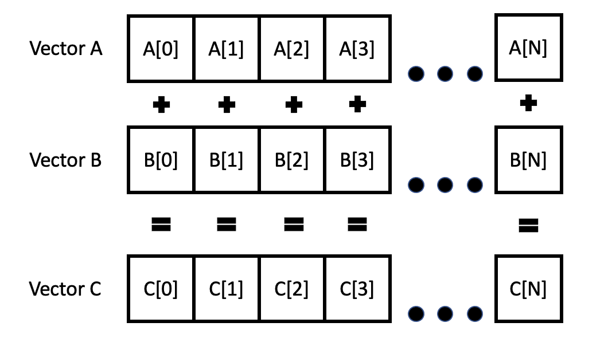

TODO: Have someone check your draft

# Basics of HIP

This tutorial will walk you through the basic components of HIP through writing a simple
Vector Add program in C++. This tutorial requires familiarity with C or C++ and does not
require familiarity with CUDA. This tutorial will use Summit for compiling and running
with its cuda-hip module. The full example code can be found in the file
vadd_hip.cpp in this repository.


## What is HIP
The Heterogeneous Interface for Portability (HIP) is AMD’s dedicated GPU programming
environment for designing high performance kernels on GPU hardware. HIP is a C++ runtime
API and programming language that allows developers to create portable applications on
different platforms. This means that developers can write their GPU applications and with
very minimal changes be able to run their code in any environment. 

The HIP module installed on Summit uses the CUDA backend and any HIP code you write gets
compiled to CUDA to run on the Nvidia GPUs. Not all the CUDA features are available in HIP
but that doesn't matter here for the purposes of our tutorial. If you're curious, [here is
the HIP and CUDA compatibility chart](https://docs.amd.com/bundle/HIP_Supported_CUDA_API_Reference_Guide/page/CUBLAS_API_supported_by_HIP.html).


## Some Basic Ideas for HIP GPU programming

Programs written for GPUs are meant to be very parallel, and GPUs are designed to fit that
programming paradigm. When you write a C++ file, the portion of the code that will
actually run on the GPU is called the _kernel_. This is defined as a function in your code
(see the vecAdd function in `vadd_hip.ccp`). You define the kernel as a function and
_launch_ the kernel on the GPU using the a call like `hipLaunchKernelGGL`. This starts a
number of _threads_ on the GPU. As part of your launch, you will specify the size of the
_grid_ and size of the _block_ (aka _workgroup_), which will determine the total number of
_threads_ that will be running on a GPU. A grid is a collection of blocks, and a block is
a collection of threads.  Threads are organized into blocks in a grid for
easier-to-understand indexing. We'll briefly cover these terms below. A video explanation
of AMD hardware organization can be found
[here](https://www.youtube.com/watch?v=uu-3aEyesWQ) which will provide some context on how
these terms map to AMD's hardware. We won't discuss AMD hardware details in this tutorial
as we focused on Summit.


### Threads

All the threads you start with the kernel launch run the same kernel. You can write your
kernel such that different threads operate on different parts of the data or do different
things based on their thread ID (much like MPI tasks). We'll talk about thread IDs when we
walk through the code later in this tutorial.


### Workgroups (CUDA term: Blocks)

Workgroup (or block) is a collection of threads. A block is assigned to a single compute
unit in the GPU. All the threads in the block have access to a small amount of shared
memory. This allows inter thread communication within the block and also useful to avoid
repeated access to main memory which can be costly. AMD hardware has an upper limit of 16 
wavefronts per block (so a max of 1024 threads per block). Trying to set a block size 
bigger than that will result in errors.

### Wavefront (CUDA term: Warp)
(TODO: have someone go through and correct the language and the information to get proper accuracy)

The threads in a block are organized into groups of 64 threads (or 32 threads for Nvidia
hardware) called a wavefront or a warp. All threads in a wavefront execute in lockstep,
i.e. no thread in a wavefront will move to the next instruction until all threads in the
wavefront are finished with the current instruction. This is something to keep in mind
when doing memory access as part of your kernel. During a memory access whole block of
memory is placed in the cache even if you only need a small part of the memory. Your
kernel can be slow if the threads in a wavefront are accessing parts of memory that are

far away from each other because the wavefront will have to do multiple serialized memory
accesses so that all the threads in the wavefront can get the data they need. Because of
the lockstep nature, the entire wavefront is being held up waiting on threads to get their
data. If you write your kernel such that adjacent threads access adjacent pieces of
memory, you utilize the cache better. This reduces the number of memory accesses and speed
up the kernel. This is called memory coalescing and is an important consideration for fast
GPU code.

### Grid

All the blocks are organized in a grid. This allows us to index to a particular
block. There could be hundreds of blocks that we start as part of the kernel launch.


### Host
The term _host_ commonly refers to the compute node the GPU is on.

### Device
The term _device_ commonly refers to the GPU.

## Explaining Vector Addition

Say we have two vectors A and B (represented as an array of numbers in code). Adding two
vectors means that we are adding each number in one vector with the corresponding number
in the other vector. So A[0] is added to B[0], A[1] is added to B[1] and so on. The
results are stored in vector C.



To do this in the GPU, we have to first declare our pointers and allocate memory for our
vectors on both host and the device memory. We will populate the host vectors, and then
memcpy the data into the device memory. We will launch the kernel that will perform the
vector addition with the data in the device memory. And we'll copy the result back into
host memory. 

## Building and running the code

Make sure you have access to a system with HIP installed with a ROCm or CUDA backend. 

For Summit, run the following commands
```
module load cuda/11.4.0
module load hip-cuda/5.1.0
hipcc -o vadd_hip vadd_hip.cpp

# submit job
bsub submit_summit.lsf
```

For Spock/Crusher
```
module load rocm/5.1.0
hipcc -o vadd_hip vadd_hip.cpp

# submit job
sbatch submit_frontier.sbatch
```


## Parts of the code


In this section we will go over relevant parts of the code. Keep the vadd_hip.cpp open in
a window next to you as we explain the relevant parts of this code.

```
#include "hip/hip_runtime.h"
```
This is the header file with the HIP function declarations that we will be using through
the rest of the code.

```
#define hipErrorCheck(call)                                                              \
do{                                                                                       \
    hipError_t hipErr = call;                                                             \
    if(hipSuccess != hipErr){                                                             \
      printf("HIP Error - %s:%d: '%s'\n", __FILE__, __LINE__, hipGetErrorString(hipErr));\
      exit(0);                                                                            \
    }                                                                                     \
}while(0)
```
It is generally good practice to always read and check the error codes from HIP. We define
this macro to read the error code returned by a HIP call, and if it is not a success then
print out the error information along with the file and line location where the error
occured. This ought to be the first place you look when debugging your HIP code. 

```
__global__ void vecAdd(double *a, double *b, double *c, int n)
{
    // Get our global thread ID
    int id = blockIdx.x*blockDim.x+threadIdx.x;
 
    // Make sure we do not go out of bounds
    if (id < n)
        c[id] = a[id] + b[id];
}
```

This is the piece of code, called the _kernel_, that is actually run on the GPU
hardware. This kernel is defined here and is later launched by a call to
`hipLaunchKernelGGL`. The same kernel is run by some number of threads as determined by
the number of blocks and number of threads per block that we define as part of the launch
call. We will see more about `hipLaunchKernelGGL` later. It is useful for the kernel to be
written such that work is split up between the threads, so that each thread is working on
a small portion of the data. HIP provides `blockIdx`, `blockDim`, and `threadIdx` in the
kernel to identify the thread. In our example, we use this so that only the thread with
that particular index performs the addition on the values in the a, b, and c array with
that same index. There's a possibility that the number of threads that we start exceed the size
of the arrays, so we do a bounds check to make sure only the threads within the size range
of the arrays operate on them. Come back and read this again after you read about kernel
launching later in this tutorial.


```
hipErrorCheck(hipMalloc(&d_a, bytes));
hipErrorCheck(hipMalloc(&d_b, bytes));
hipErrorCheck(hipMalloc(&d_c, bytes));
```

This allocates memory on the GPU for each of the three variables. No special datatype is
being used for the pointer to the allocated memory on the device. As you see here, we wrap
every HIP call with the hipErrorCheck macro we defined earlier. Notice that this is
updates the pointer in place which is different than malloc which returns a pointer.


```
hipErrorCheck(hipMemcpy(d_a, h_a, bytes, hipMemcpyHostToDevice));
hipErrorCheck(hipMemcpy(d_b, h_b, bytes, hipMemcpyHostToDevice));
```

This copies the vectors we defined and filled on the host into the GPU memory. The first
argument to hipMemcpy is the source for the memcpy and the second argument the destination. The
hipMemcpyHostToDevice signals that the source is the host memory and the destination is the
device memory for this copy operation. This flag is necessary for the copy operation to
complete correctly.


```
hipLaunchKernelGGL(vecAdd, dim3(gridSize), dim3(blockSize), 0, 0, d_a, d_b, d_c, n);
```

This launches the GPU _kernel_ we defined earlier. The parameters you see are:
* vecAdd - name of the kernel we defined
* dim3(gridSize) - this passes a 3d grid defining the total number of blocks. In this case
  we are passing gridsize=ceil(n/blockSize) == 94 blocks in this run. In our example, we
  are only using 1 dimension of the grid, any undefined dimensions are set to 1 by
  default. We can define this in 3 dimensions as well, so something like dim3(5,5,5) will
  create 125 (5*5*5) blocks in the grid. Using more than one dimension allows us to use
  `BlockIdx.y` and `BlockIdx.z` when trying to identify the a particular block of the
  thread running in the kernel.
  (Note: Choosing a 1D, 2D, or 3D grid depends on the problem your working in. If your
  problem surface is 2D or 3D, setup your grid accordingly. In our case for vector add, we
  are just adding two 1D vectors, so a 1D grid is appropriate here.
* dim3(blockSize) - this defines the total number of threads in a single block, using up
  to three dimensions. In our example we have 1024 threads in a block (remember that a
  block is different from a wavefront) along just one dimension. Similar to gridSize,
  using more than one dimension allows us to use `threadIdx.y` and `'threadIdx.z` as well
  to identify the current thread.
* 0 (type: `size_t`)  - Amount of additional shared memory to allocate in the GPU when launching the kernel 
* 0 `hipStream_t` - The stream where the kernel should execute. A value of 0 corresponds
  to the NULL stream. Streams allow separation of concerns. Streams also allow you to overlap
  different kernel launches or copies between host and device, instead of doing them one
  at a time. This increases our
  concurrency and could allow us to overlap a kernel launch in one stream while data copy
  is happening in another stream. We will cover streams in a different tutorial. [Here is a
  brief explanation of how streams work in Cuda](https://leimao.github.io/blog/CUDA-Stream/).


```
hipError_t hipErrSync  = hipGetLastError();
hipError_t hipErrAsync = hipDeviceSynchronize();
```
It is useful to perform these error checks to catch any issues that might have occured
during the kernel launch.

```
hipErrorCheck(hipMemcpy( h_c, d_c, bytes, hipMemcpyDeviceToHost));
```
This copies the data from the GPU memory back into the host memory we had malloc'ed
earlier so we can inspect it.


## Additional Resources

Fundamentals of HIP programming: [https://developer.amd.com/resources/rocm-learning-center/fundamentals-of-hip-programming/](https://developer.amd.com/resources/rocm-learning-center/fundamentals-of-hip-programming/)
AMD GPU hardware: https://www.youtube.com/watch?v=uu-3aEyesWQ
Main AMD documentation: https://docs.amd.com/

## Exercises
TODO: add exercises
1. Try playing around with the size of the arrays, blocks, and grid size.
2. What errors do you run into when you don't have the bounds check in the kernel? If it doesn't, why not?
3. Try adjusting the blockSize so that it is greater than 1024. What happens?
