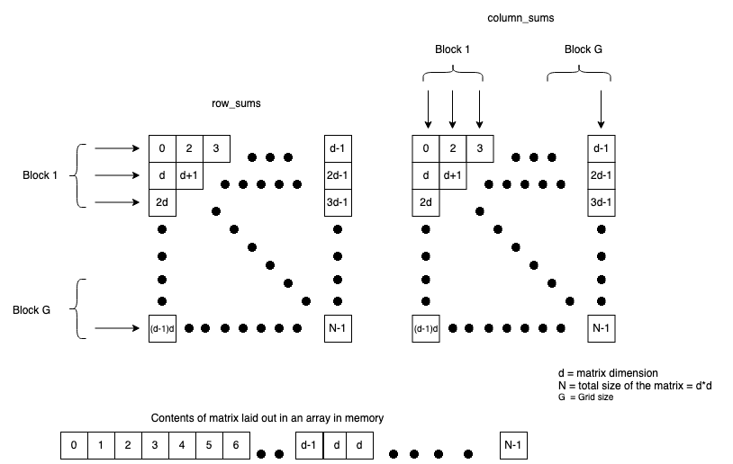
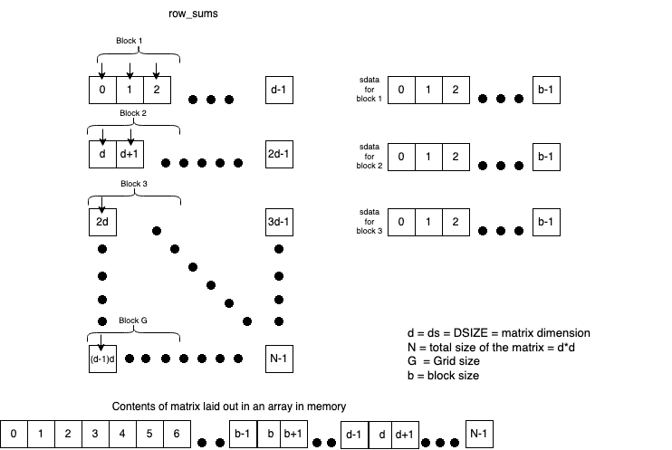

# Memory Coalescing

<!--
(TODO: the developer.amd matrix transpose example isn't really a good example of memory
coalescing as it looks like the number of write and read transactions is more or less the
same between the naive and lds examples.)
-->

Effective use of cache is something to keep in mind while doing GPU operations. When a
memory access to data in the GPU memory occurs, a block of data is actually brought into
the cache in the CU (TODO: citation needed - is cache in the CU). If different threads in
a block are accessing wildly different parts of the memory, you will be facing a lot of
cache misses as the memory operations have to be serialized, the cache cleared out and new
data is brought into the cache to fulfill each thread's request. So it is good practice to
structure your kernel code such that adjacent threads in a block access adjacent data to
maximize use of the cache. This way of organizing your data access to take advantage of
the cache and reduce the number of memory transactions is called _memory coalescing_.

## How Effective is Memory Coalescing?

For example, let us take the `matrix_sums_unoptimized.cpp` code. Here we are creating a
16384x16384 matrix and each element of the matrix is 1. In memory, we represent this
matrix as a 1 dimensional array. We have two kernels, one that calculates the sum of the
rows, and one that calculates the sum of the columns. We also allocate an array of size
16384 in the main memory and GPU memory to store the row sum or the column sum. We set the
block size to 256 and the grid size (i.e. number of blocks) such that there are at least
16384 threads, so one thread for each row or column we are summing. Much of
the HIP calls should now look familiar to you after the seeing [the earlier module with
the vector add example](TODO). Briefly, let us go over the `row_sums` and `column_sums`
kernel .

```
// matrix row-sum kernel
__global__ void row_sums(const float *A, float *sums, size_t ds) {

  // create typical 1D thread index from built-in variables
  int idx = threadIdx.x + blockDim.x * blockIdx.x;
  if (idx < ds) {
    float sum = 0.0f;

    // write a for loop that will cause the thread to iterate across
    // a row, keeping a running sum, and write the result to sums
    for (size_t i = 0; i < ds; i++)
      sum += A[idx * ds + i];
    sums[idx] = sum;
  }
}
```

The row sum is done by assigning each thread up to 16384 (i.e. the size of the matrix) one
of the rows of the matrix. Each thread will then sum the values in that row. The `idx <
ds` is to ensure that if there are any more threads than there are rows, the extra threads
just no-op (ideally you would make sure that no thread is idle and avoid thread divergence
as much as possible. In our case, we are actually starting 16384 threads because of how we
calculate the grid size for our kernel launch, so there are no extraneous threads in this
example. The if statement is just a precaution). Since the matrix is represented as a 1
dimensional array, each thread needs to jump to the starting point of the row
corresponding to its `idx` value and then sum the values in that row.

```
// matrix column-sum kernel
__global__ void column_sums(const float *A, float *sums, size_t ds) {
  // create typical 1D thread index from built-in variables

  int idx = threadIdx.x + blockDim.x * blockIdx.x;
  if (idx < ds) {
    float sum = 0.0f;

    // write a for loop that will cause the thread to
    // iterate down a column, keeeping a running sum,
    // and write the result to sums
    for (size_t i = 0; i < ds; i++)
      sum += A[idx + ds * i];
    sums[idx] = sum;
  }
}
```

The column sum operates on the same principle as the row sum: each thread is assigned a
column. Each thread will step to the next value in the column, which is `ds` items away
in the 1D array from the previous value in the column. 


### Building and running the code

Make sure you have access to a system with HIP installed with a ROCm or CUDA backend. Make
sure you update the submit scripts with the project in the batch job directives and in the
`OUTPUT` variable.

For Summit, run the following commands
```
module load cuda/11.4.0
module load hip-cuda/5.1.0
hipcc -o matrix_sums_unoptimized matrix_sums_unoptimized.cpp

# submit job
bsub submit_summit_unoptimized.lsf
```

For Spock/Crusher
```
module load rocm/5.2.0
hipcc -o matrix_sums_unoptimized matrix_sums_unoptimized.cpp

# submit job
sbatch submit_frontier_unoptimized.sbatch
```

The submit scripts for Summit and Crusher run the executable with the nsys profiler and
the rocprof profiler respectively.

### Examining the Results of the Kernel Profiling

From the output file of the Summit run, you will see a section titled `CUDA Kernel
Statistics` with the table summarizing the run time of
the two kernels. It will look something like this

```
CUDA Kernel Statistics:

 Time(%)  Total Time (ns)  Instances  Average (ns)  Minimum (ns)  Maximum (ns)  StdDev (ns)                         Name
 -------  ---------------  ---------  ------------  ------------  ------------  -----------  --------------------------------------------------
    60.0          3263784          1     3263784.0       3263784       3263784          0.0  row_sums(const float *, float *, unsigned long)
    40.0          2176528          1     2176528.0       2176528       2176528          0.0  column_sums(const float *, float *, unsigned long)
```

The Crusher run will produce a couple of files labelled
`metrics_matrix_sums_unoptimized.csv` and `metrics_matrix_sums_unoptimized.stats.csv`. If
you open the `metrics_matrix_sums_unoptimized.stats.csv` file with a csv pretty printer, it
will look something like this:

```
                                                        Name | Calls | TotalDurationNs |     AverageNs |             Percentage |
                                init_kernel(int) [clone .kd] |     1 |   5009696594793 | 5009696594793 |       99.9965743623855 |
   row_sums(float const*, float*, unsigned long) [clone .kd] |     1 |       165115927 |     165115927 |  0.0032958137803856266 |
column_sums(float const*, float*, unsigned long) [clone .kd] |     1 |         6504003 |       6504003 | 0.00012982383410577622 |
```


(Note: Ignore the `init_kernel` line. That is just an empty kernel necessary to initialize
rocprof properly so it will calculate the duration and other metrics for our kernels
correctly. This is an issue that will be fixed in future releases of ROCm.)


You will notice that the `row_sums` kernel is actually slower than the `column_sums`
kernel. Why is that?



This is because the `column_sums` kernel actually makes better use of _memory
coalescing_. Recall that when you read a piece of data from memory, it will load that
memory into the cache along with some data that was adjacent to it because there is a
reasonable assumption that if you need some data you will likely also need the data next
to it. We can take advantage of this by making sure that threads that are adjacent to each
other (i.e. threads in the same block or same wavefront even) make use data that is
adjacent to each other. As you can see from the figure above, for `column_sums`, when
thread with `idx 0` accesses A[0], `idx 1` accesses A[1], `idx 2` accesses A[2] and so
on. Since A[1], A[2], A[3] are all adjacent to each other, they will all brought to the
cache together, and we don't have to do separate memory lookups for getting the data for
`idx 2` and `idx 3` which are executing in the same wavefront. This saves a lot of time.

Contrast this with `row_sums`. When `idx 0` accesses A[0], `idx 1` is accessing `A[1*ds ==
16384]`, `idx 2` is accessing `A[2*ds == 32768]` and so on. Since `idx` 0,1,2 are all in
the same wavefront but are accessing data that is far away from each other, the data is
not all in the cache and each thread will have to wait for a cache miss to happen, the
data to be copied from memory into the cache, and then do its operation. And since threads
in a wavefront execute in lockstep, each time a memory access happens the whole wavefront
is held up because each thread in the wavefront is effectively being serviced one at a
time rather than all at once. So you can see how this can slow things down a lot. There is
no _memory coalescing_ here.


# GPU Shared Memory with HIP

So how do we improve the performance of the sum of the rows. We can take advantage of
block level shared memory to bring the data even closer to the threads to avoid all the
memory transactions to the GPU memory. This shared memory is called Local Data Store or
LDS. Each block can have a maximum of 64KiB (65536 bytes) of LDS and this memory lives on
the CU. This LDS is visible only within a block. If there are
multiple blocks, each block will have its own LDS. Let us look at a modified example of
the row sum kernel in `matrix_sums_optmized.cpp`. The `column_sums` kernel is unchanged
but the `row_sums` kernel has been reworked. Whereas column sum is taking advantage of the
cache locality, the row sum kernel will explicitly move the data into block level shared
memory.

Let us break down the modified `row_sums` kernel. A thing to note is that is launch kernel
call

```
hipLaunchKernelGGL(row_sums, dim3(DSIZE), dim3(block_size), 0, 0, d_A, d_sums, DSIZE);
```

We are actually starting `DSIZE` number of blocks, so we make use of a whole block of
threads for each row in the matrix, unlike before where we start enough blocks such that
we have one thread for each row instead of a whole block.

```
__global__ void row_sums(const float *A, float *sums, size_t ds) {

  int idx = blockIdx.x; // our block index becomes our row indicator
  if (idx < ds) {
    __shared__ float sdata[block_size];
    int tid = threadIdx.x;
    sdata[tid] = 0.0f;
    size_t tidx = tid;

    while (tidx < ds) { // block stride loop to load data
      sdata[tid] += A[idx * ds + tidx];
      tidx += blockDim.x;
    }

    for (unsigned int s = blockDim.x / 2; s > 0; s >>= 1) {
      __syncthreads();
      if (tid < s) // parallel sweep reduction
        sdata[tid] += sdata[tid + s];
    }
    if (tid == 0)
      sums[idx] = sdata[0];
  }
}
```



We create the LDS with `__shared__ float sdata[block_size]` to create a float array in
shared memory. This is statically allocated. (If you wish to dynamically allocate this
memory instead, you will instead write `extern __shared__ float sdata[];` and the kernel
launch will look like `hipLaunchKernelGGL(row_sums, dim3(DSIZE), dim3(block_size), sizeof(float)*block_size, 0,
d_A, d_sums, DSIZE);` where we pass `sizeof(float)*block_size` instead of 0 to tell HIP to allocate
that many bytes of shared memory for the each block when launching the kernel).

In the while loop, each thread in the block will sum the numbers in the row
starting from the location corresponding to its `tid` and each next number that is
`blockDim.x` distance away till it reaches the end of the row, and this sum is stored in
the LDS array at the location corresponding to that thread's `tid`. Each block will then
perform a _parallel sweep reduction_ on the LDS array. In the for loop, we will start with
half the threads in the block, where each thread will sum the numbers at `tid` position
and `tid+s` position in the LDS `sdata` where `s` is half the block size and `tid` is the
thread's `threadIdx.x`.  The sum for each thread is stored in the LDS array at
`sdata[tid]`. In the next iteration, the `s` value is halved, so now only a quarter of the
threads in the block are used to sum the numbers at `tid` and `tid+s`. This halving
continues until `s` is 0 and `sdata[0]` will be the sum of all the numbers in `sdata` that
was inserted during the earlier while loop, and thus it is the sum of all the numbers in
the row that block was assigned to. `__syncthreads()` ensures that all the threads in the
block will reach that location first before any thread moves to the next instruction. This
prevents race conditions.


### Building and running the code

This process should be familiar to you by now.

Make sure you have access to a system with HIP installed with a ROCm or CUDA backend. Make
sure you update the submit scripts with the project in the batch job directives and in the
`OUTPUT` variable.

For Summit, run the following commands
```
module load cuda/11.4.0
module load hip-cuda/5.1.0
hipcc -o matrix_sums_optimized matrix_sums_optimized.cpp

# submit job
bsub submit_summit_optimized.lsf
```

For Spock/Crusher
```
module load rocm/5.1.0
hipcc -o matrix_sums_optimized matrix_sums_optimized.cpp

# submit job
sbatch submit_frontier_optimized.sbatch
```

The submit scripts for Summit and Crusher run the executable with the nsys profiler and
the rocprof profiler respectively.

(TODO: show how to run profiler on Summit and crusher and compare results with previous
row sum run that didn't use shared memory)

### Examining the Results of the Kernel Profiling

From the output file of the Summit run, you will see a section titled `CUDA Kernel
Statistics` with the table summarizing the run time of the two kernels. It will look
something like this. 

```
CUDA Kernel Statistics:

 Time(%)  Total Time (ns)  Instances  Average (ns)  Minimum (ns)  Maximum (ns)  StdDev (ns)                         Name
 -------  ---------------  ---------  ------------  ------------  ------------  -----------  --------------------------------------------------
    61.6          2151316          1     2151316.0       2151316       2151316          0.0  column_sums(const float *, float *, unsigned long)
    38.4          1342203          1     1342203.0       1342203       1342203          0.0  row_sums(const float *, float *, unsigned long)
```


The Crusher run will produce a couple of files labelled
`metrics_matrix_sums_optimized.csv` and `metrics_matrix_sums_optimized.stats.csv`. If
you open the `metrics_matrix_sums_optimized.stats.csv` file with a csv pretty printer, it
will look something like this:

```
                                                        Name | Calls | TotalDurationNs |   AverageNs |           Percentage |
                                init_kernel(int) [clone .kd] |     1 |     29486987205 | 29486987205 |     99.4713316207119 |
   row_sums(float const*, float*, unsigned long) [clone .kd] |     1 |       150249981 |   150249981 |   0.5068529240424534 |
column_sums(float const*, float*, unsigned long) [clone .kd] |     1 |         6466909 |     6466909 | 0.021815455245657957 |
```

**NOTE**: This is super weird why `column_sums` is still faster than the optimized `row_sums`
when you run this on crusher, but `row_sum` is faster than `column_sums` on Summit. What's
happening here?


<!--
## Memory banks and bank conflicts
TODO: clean up and add accurate information.
TODO: we can use the matrix transpose example here as we found it is a good example to use 
to teach about bank conflicts and how to move data to minimize the conflicts.

The shared memory that is visible to all the threads of a block are made up of memory
banks. Each memory bank is of TODO bit words. If multiple threads in the same wavefront
from a block try to access the same bank (even if they are trying to use different data),
this is a bank conflict. These accesses have to be serialized which could affect the
latency. A way to mitigate bank conflicts is to try and make sure that the threads are set
up in such a way that threads in a wavefront are accessing different memory banks to avoid
the bank conflicts. 


For example, let us look at code that does a matrix transpose, utilizing the LDS. Each
thread in a block first identifies a value in the in matrix and moves it to the LDS. All
the threads are then synced and then the values from the LDS are moved to the appropriate
locations in the out matrix. (TODO: supposedly this was supposed to be faster and have
fewer write memory transactions than the naive way where we copy directly from the in
matrix to the outmatrix without using the LDS intermediary, but rocprof doesn't show that
even though their video tutorial does. I'm not sure what's going on here. However the
matrix transpose is a good example for bank conflicts because copying from  `in matrix ->
lds[x][y] -> out matrix` has a lot of bank conflicts, but copying `in matrix -> lds[y][x]
-> out matrix` has 0 bank conflicts because each thread in a warp is accessing a different
memory bank because it is accessing columnwise (whereas in the previous each thread in the
warp access data row wise which may all fall on the same memory bank leading to
conflicts). (TODO: have someone verify the previous statement if it's true or not).

(TODO: show how to use profiler on summit and crusher to see the speed results and print 
out the bank conflict information)

## Building and running the example with a profiler


TODOs:
1. What is the maximum shared memory in the AMD GPUs?
2. How are memory banks set up? how many memory banks constitute shared memory? how much
   data per memory bank? How do you handle bank conflicts better?
3. What is memory coalescing? How can using shared memory help?
4. Why do you want to use shared memory?
5. Why do you use __syncthreads? (to avoid race conditions between threads in the same block accessing the shared memory).
6. What are the limits of block level shared memory? MI250x only hsa upto 64kb of shared memory allocatable in a kernel launch. 


-->
